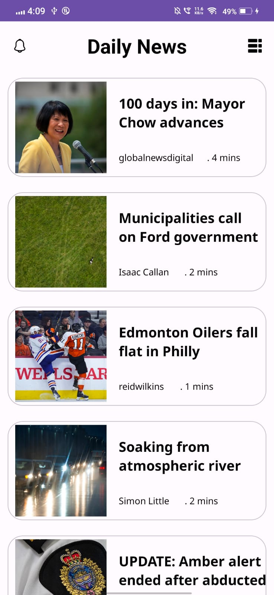
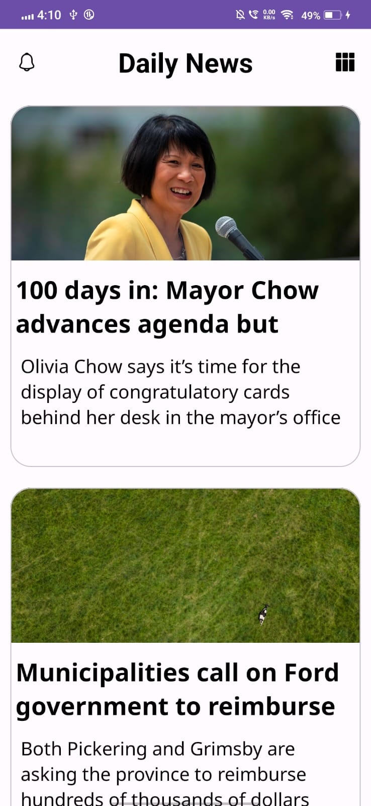

# NewsHub-News-Application
The NewsHub Android Application keeps you in the know with the latest news. Get access to real-time updates from the Global News website via a REST API, offering a seamless way to stay informed

## Run the application 

### Points to remember : 

- Android studio should be installed in the system  (prefer latest  version )
- Git should be installed in the system


```bash
  mkdir NewsHub - newsApplication

  cd NewsHub

  git clone https://github.com/VinayakGardi/NewsHub-News-Application.git

```
- Run android studio 
- run the project in emulator or any physical device
## Features
- Display the news in the UI fetched from the API.
- Can display data in 2 different formats.
- Displays detailed view of the news article as well.
- Also shows all the data in the rich text i.e photos, videos, and links can be opened in the browser.

## Screenshots

<!-- Screenshots -->
<div style="display: flex; justify-content: space-between;">
  
  
  
</div>


## Technology used
- Kotlin - Programming language for Android app development.
- Room - Persistence library for database management.
- REST API - REST API is a way of accessing web services in a simple and flexible way without having any processing.
- ViewModel - Architecture component for managing UI-related data.
- LiveData - Observable data holder for communication between components.
- RecyclerView - Flexible view for displaying lists or grids.
- Material Design - Modern and visually appealing UI components.
